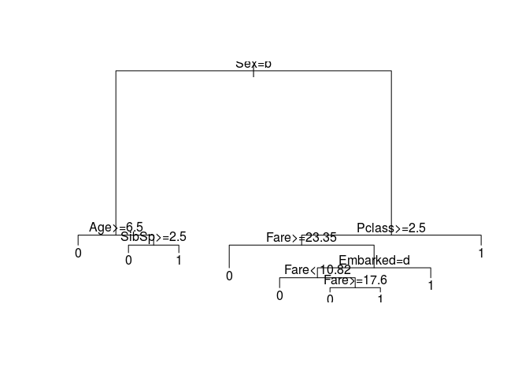
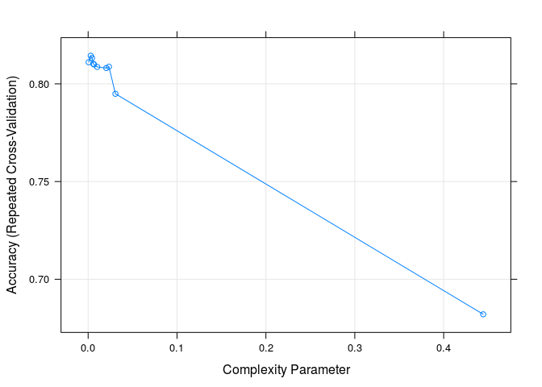
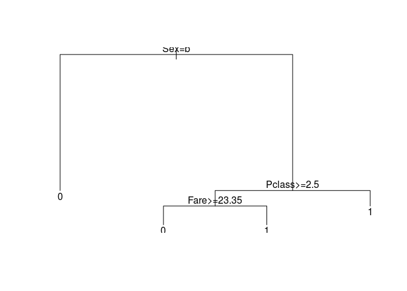
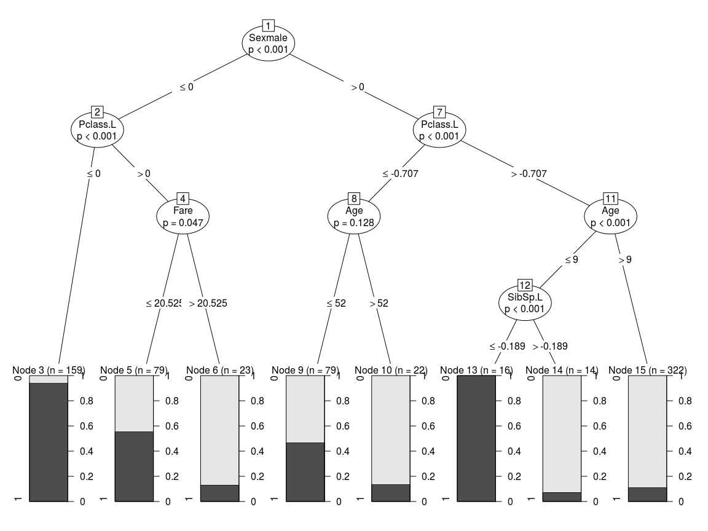

# A dicision tree applied to Titanic data set
Andrey Ziyatdinov  
`r Sys.Date()`  


# Include

Library that implements the decision tree algorithm:


```r
library(rpart)
```

# Parallel


```r
library(doMC)
registerDoMC(cores = 2)
```

# Data


```r
test <- fread("~/git/variani/kaggle/titanic/data/test.csv", data.table = F)
train <- fread("~/git/variani/kaggle/titanic/data/train.csv", data.table = F)
```

## Cleaning


```r
train <- within(train, {
  Embarked[Embarked == ""] <- NA
})
```

## Transform


```r
mutate2_dat <- function(df) 
{
  within(df, { 
    Pclass <- ordered(Pclass)  
    Sex <- factor(Sex)
    SibSp <- ordered(SibSp)
    Parch <- ordered(Parch, levels = c("0", "1", "2", "3", "4", "5", "6", "9"))
    Embarked <- factor(Embarked)
  })
}

train2 <- mutate2_dat(train)
test2 <- mutate2_dat(test) 
```


# Model 1: recursive partitioning tree (rpart)


```r
fit1 <- rpart(Survived ~ Pclass + Sex + Age + SibSp + Parch + Fare + Embarked, 
  data = train, method = "class")
```

Plot the tree:


```r
plot(fit1)
text(fit1)
```

 

Performance on the training set:


```r
tab <- table(train$Survived, predict(fit1, train, type = "class"))
tab
```

```
   
      0   1
  0 521  28
  1 115 227
```

```r
# accuracy
sum(diag(tab)) / sum(tab)
```

```
[1] 0.8395062
```

Performance on the trainig set was shown [here](http://trevorstephens.com/post/72923766261/titanic-getting-started-with-r-part-3-decision)
to be `0.78`.

Make a submission by yourself.


```r
pred1 <- data.frame(PassengerId = test$PassengerId, Survived = predict(fit1, test, type = "class"))
write.csv(pred1, file = "pred1.csv", row.names = FALSE)
```

Result: `0.78469` (#2030, as of 20 April, 2016)

# Model 2: recursive partitioning tree (rpart) + prunning


```r
Yt <- as.factor(train$Survived)
Xt <- subset(train, select = c("Pclass", "Sex", "Age", "SibSp", "Parch", "Fare", "Embarked"))

trControl <- trainControl(method = "repeatedcv", number = 5, repeats = 10, selectionFunction = "tolerance") 

set.seed(1)
fit2 <- train(Xt, Yt, trControl = trControl, method = "rpart", tuneLength = 10)

mod2 <- fit2$finalModel
```


```r
fit2
```

```
CART 

891 samples
  7 predictors
  2 classes: '0', '1' 

No pre-processing
Resampling: Cross-Validated (5 fold, repeated 10 times) 
Summary of sample sizes: 714, 713, 713, 712, 712, 712, ... 
Resampling results across tuning parameters:

  cp            Accuracy   Kappa    
  0.0005847953  0.8110645  0.5933483
  0.0029239766  0.8143881  0.5994412
  0.0043859649  0.8132416  0.5951587
  0.0058479532  0.8102587  0.5874416
  0.0065789474  0.8099160  0.5859729
  0.0102339181  0.8086567  0.5799991
  0.0204678363  0.8080847  0.5801667
  0.0233918129  0.8087701  0.5823279
  0.0307017544  0.7949259  0.5547396
  0.4444444444  0.6820755  0.2200605

Accuracy was used to select the optimal model using  a tolerance rule.
The final value used for the model was cp = 0.02339181. 
```

```r
plot(fit2)
```

 

When applying `predict` function to prunned tree `fit2`, the best model is used.


```r
table(predict(fit2, test), predict(fit2$finalModel, test, type = "class"))
```

```
   
      0   1
  0 272   0
  1   0 146
```

Make a submission #2.


```r
pred2 <- data.frame(PassengerId = test$PassengerId, Survived = predict(fit2, test))
write.csv(pred2, file = "pred2.csv", row.names = FALSE)
```

Result: `0.78469` (exactly the same as #1).


```r
table(pred1$Survived, pred2$Survived)
```

```
   
      0   1
  0 266  22
  1   6 124
```

Plotting the model #2 shows that it is rather simple.


```r
plot(mod2)
text(mod2)
```

 

# Model 3: recursive partitioning tree (ctree) + prunning


```r
Yt <- as.factor(train2$Survived) 
Xt <- subset(train2, select = c("Pclass", "Sex", "Age", "SibSp", "Parch", "Fare", "Embarked"))

trControl <- trainControl(method = "repeatedcv", number = 5, repeats = 10, selectionFunction = "best") 

set.seed(1)
fit3 <- train(Xt, Yt, trControl = trControl, method = "ctree", tuneLength = 10)

mod3 <- fit3$finalModel
```


```r
plot(mod3) 
```

 

Make a submission #3.


```r
Xp <- subset(test2, select = c("Pclass", "Sex", "Age", "SibSp", "Parch", "Fare", "Embarked"))
pred3 <- data.frame(PassengerId = test$PassengerId, Survived = predict(fit3, Xp))
write.csv(pred3, file = "pred3.csv", row.names = FALSE)
```

```
0.79426

3	Fri, 20 May 2016 16:11:23

Your Best Entry
You improved on your best score by 0.00957. 
You just moved up 648 positions on the leaderboard.
```


```r
table(pred1$Survived, pred3$Survived)
```

```
   
      0   1
  0 263  25
  1   1 129
```

